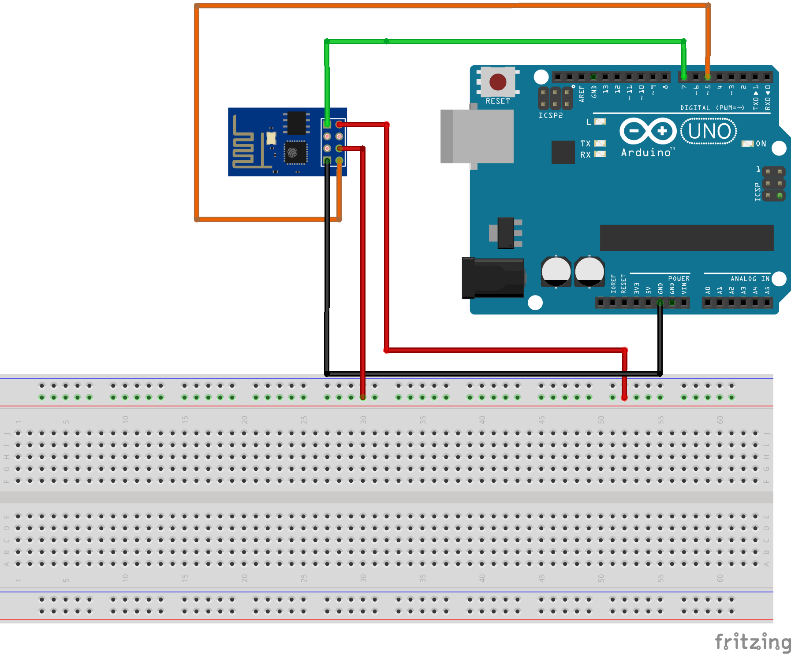
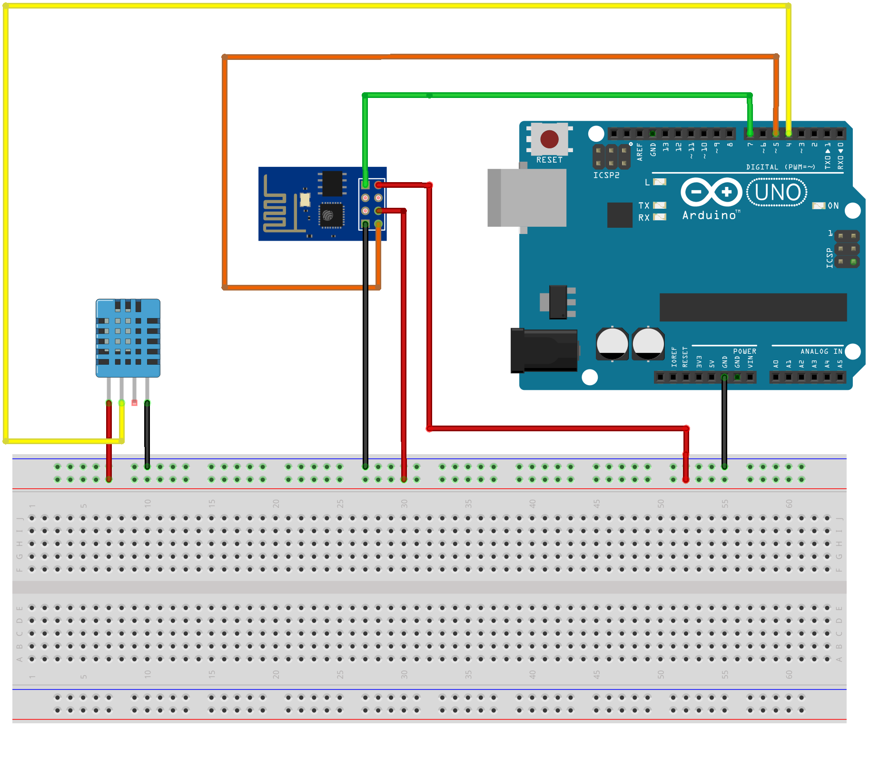

# esp8266_resources
This Arduino project shows how you can implement ESP8266 with a DHT11 (Digital Humidity and Temperature) sensor. 

Parts Used:  
1. Arduino Uno R3  
2. ESP8266 01  
3. DHT11  
4. Breadboard  
5. Jumper wires  

Schematic of Arduino with ESP8266

Scematic of Arduino with ESP8266 and DHT
